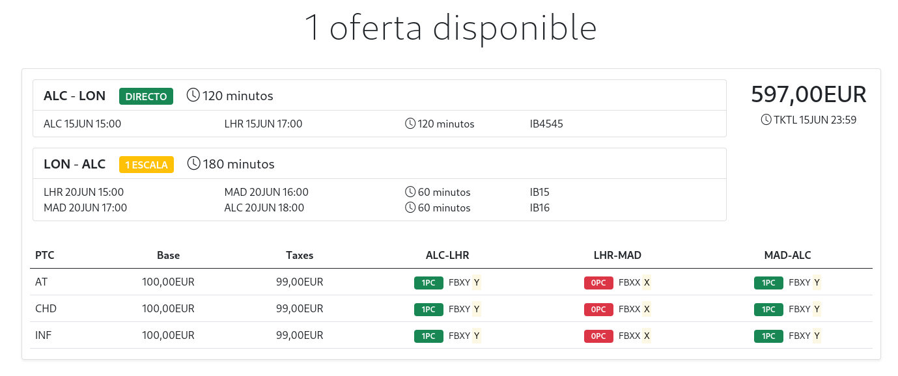

## Descripción de la prueba técnica
Desarrollar una aplicación utilizando el esqueleto de Symfony 5.3 de este repositorio, que obtenga ofertas aéreas de una API mock y las muestre en pantalla.
Por la naturaleza de la prueba y por no demorar la finalización de la misma, no es necesario realizar la validación de los datos obtenidos.
### Evaluación
Se evaluarán los siguientes aspectos técnicos:
- Conocimientos en GIT.
- Conocimientos en Symfony y el patrón MVC.
- Conocimientos en el consumo de APIs.
- Conocimientos del sector aéreo, comprensión de ofertas y asociación de datos.
### Depedencias
- PHP 8.0
- Librería cURL.
- Binario de Symfony `(#1)`.
- Cuenta en GitHub.
### Descripción técnica
Partiendo del proyecto esqueleto `gac-air-technical-interview-test` y teniendo en cuenta el patrón MVC _(exceptuando el modelado de datos, y por ende la gestión de base de datos)_.
1. Realizar un fork del repositorio público https://github.com/josecdv/gac-air-technical-interview-test.git.
2. Consumir la siguiente mock API con cURL `(#2)` o la librería HTTP Client de Symfony `(#3)` _(no incluida en el esqueleto)_. La API devolverá ofertas aéreas basadas en el esquema 17.2 de IATA NDC.
- Endpoint: https://airmockupapi.gac.travel
- Método: GET
- Autenticación. Authorization Basic `(#4)`
- Nombre usuario: demo
- Contraseña: demo
3. Interpretar la respuesta obtenida con `DOMDocument` o `SimpleXML` y cargar los datos sobre una estructura intermedia _(array u objeto)_.
4. Renderizar el array de ofertas en la vista `availability.html.twig` utilizando TWIG y la estructura intermedia generada en el punto anterior. La vista dispone del render de una oferta con datos estáticos sobre la que trabajar.



### Información de utilidad
A continuación se listan una serie de puntos que pueden ser de ayuda para agilizar la finalización de la prueba técnica.
#### Symfony Local Web Server
Symfony proporciona un servidor web para el entorno de desarrollo. 
Si tienes varias versiones de PHP instaladas en tu equipo, puedes decirle a Symfony cuál usar. Para ello, creaa un archivo llamado `.php-version` en el directorio raíz del proyecto con la versión a utilizar:
```
echo 8.0.6 > .php-version
```
Ejecute el siguiente comando si no recuerda todas las versiones de PHP instaladas en tu equipo:
```
symfony local:php:list

```
Una vez configurada la versión de PHP a utilizar, puede ejecutar el servidor web:
```
symfony server:start
```
#### Maker Bundle
Se permite el uso del paquete `maker` de Symfony, ya requerido como librería.
```
symfony console list make
```
### Notas
1. https://symfony.com/download
2. https://www.php.net/manual/es/book.curl.php
3. https://symfony.com/doc/current/http_client.html
4. https://developer.mozilla.org/es/docs/Web/HTTP/Headers/Authorization